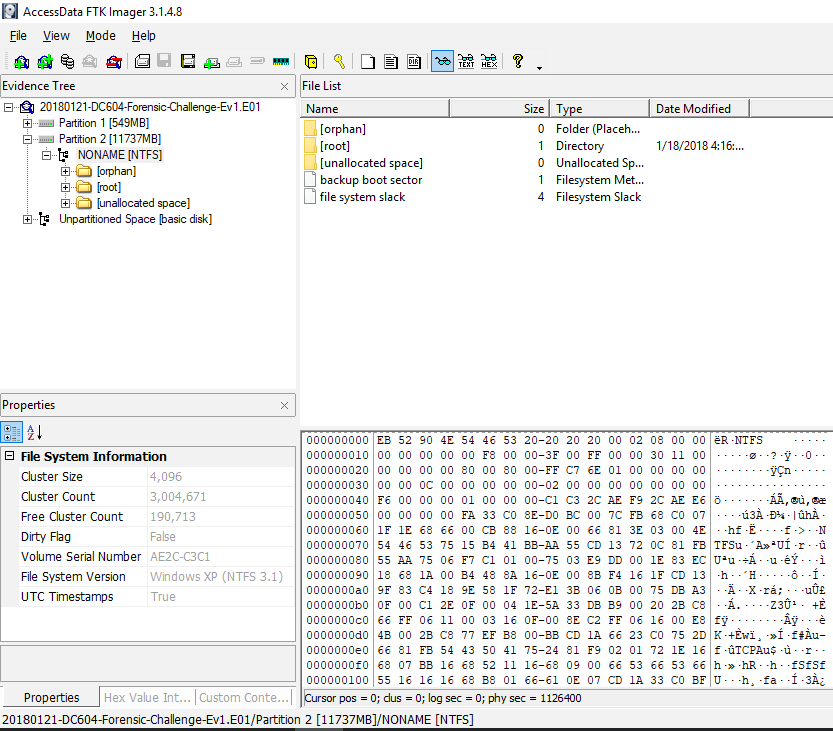
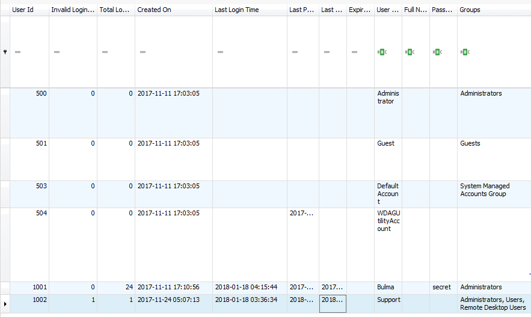
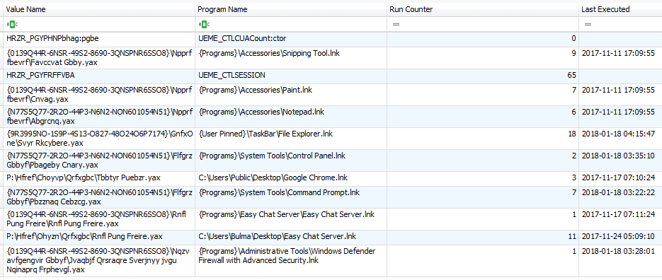
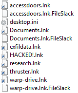

Scenario
--------
The client, Bulma, carried out top secret research to build a time machine and stored it on her personal laptop. She logged into her computer to find a message from a hacker and missing research.

Her research was in three files: `warp-drive.pdf`, `accessdoors.pdf`, and `thrusters.pdf`.

She has provided a full disk image of the hard drive and wants us, the leet investigators, to get to the bottom of the theft and recover her data.

CTF Format
----------
This is a Jeopardy-style CTF with a set of leading questions to guide the investigation. A .E01 file containing Bulma's disk image is provided.

Challenge 0: What is an .E01?
-----------------------------
...and what do I do with it?

It is an [Encase image file] used to store and compress digital evidence, including disk images. In this case, the 6.2 GB file contains the complete contents, including unallocated space, of Bulma's hard disk. Once mounted as a drive, it is 12 GB.

We mounted the image using AccessData FTK Imager. Under *File > Image Mounting*, we tried a few combinations of options:
1. *Physical Only, Block Device / Read Only*: no errors, but could not access the resulting drive
1. *Physical & Logical, Block Device /  Read Only*: a flurry of error dialogs, then could not access the resulting drive
1. *Physical & Logical, Block Device / Writeable*, as per this [tutorial] : errors and no access, but we got a write cache file in the same directory as the E01 image
1. *Physical & Logical, Block Device /  Read Only*, plus the magic touch of the CTF host: the disk partitions mounted and were accessible as D: and F:. We have no idea why this worked the second time. However, it turns out block device is a suboptimal choice when mounting the Windows image on a Windows host, because file access permissions are in effect and your host user may not have permission to access necessary files in the mounted image. 
1. *Physical & Logical, File System / Read Only*: success! When the image is mounted as a file system instead, access control and accounts are disregarded.

FTK Imager mounted a 549 MB `System Reserved` partition to `D:` and a 11737 MB `NONAME` parition to `F:`. `F:` contains the regular operating system and user data. We didn't look at `D`; presumably it is a system recovery partition.

FTK Imager can also be used to browse the E01 disk image, complete with extensive file properties, hex dumps (everyone loves a hex dump), and many unexplored features. The benefit of using FTK Imager is that timestamps (and other properties?) are displayed exactly as they are on the disk image, rather than interpreted through the host OS timezone. This is useful when you want to keep your timeline straight. (We also found it useful to set our computer to UTC so we knew exactly what timezone scripts and tools were outputting.)

To load the image in FTK Imager, go to *File > Add Evidence Item*, select *Image File*, and select the E01 file.



Challenge 1: System Information
-------------------------------

We solved the challenges in this category by pulling values out of the registry using [Registry Explorer], [RegRipper], and [SAMInside]. None of us were particularly familiar with the registry before this CTF, so we used a combination of search engine fu and the MSDN page on [registry hives] to find which files to look in.

### What is the 5-digit OS build number?

Info about the Windows version is stored in the key `HKEY_LOCAL_MACHINE\SOFTWARE\Microsoft\Windows NT\CurrentVersion`. We loaded the Software hive (`C:\Windows\system32\config\SOFTWARE`, though in this case it was `F:\[root]\...`) in Registry Explorer and found the `CurrentBuild` value. Here it is worth noting that Bulma uses Windows 10, because some information is stored differently in different versions of Windows and you want to know what to look up.

### What was the last IP address given to this machine?

TCP/IP parameters are stored in the `HKEY_LOCAL_MACHINE\System` hive (`...\system32\config\SYSTEM`). The specific key is `HKEY_LOCAL_MACHINE\SYSTEM\ControlSet01\Services\Tcpip\Parameters\Interfaces`. It has four ID-string-subkeys. Only one of them has any IP address data. The last IP address is given by the `DhcpIPAddress` value.

### How many user accounts with an RID >= 1000?

Information about user accounts is stored in the `HKEY_LOCAL_MACHINE\SAM` (Security Account Manager) hive (it lives in the same place as the last two). Apparently, this hive is usually hidden even from admins, but mounting the entire disk image as a file system circumvents that. This [what-when-how post] explains that much of the information is encoded, but fortunately the tools we used decoded it. That post also explains what an RID is, for those of you as unfamiliar with Windows as we are.

We used SAMinside to answer this question. There are two user accounts with RID >= 1000: Bulma, and Support.

SAMinside seems designed more for password cracking than general information. At the time of writing this, we discovered that Registry Explorer would have been sufficient and gives more information.



The figure shows `HKEY_LOCAL_MACHINE\SAM\Domains\Account\Users`. Check out the Support account. On one hand, looks innocuous... On the other hand, it was created long after Bulma's account, logged in shortly before her last login (when she discovered her missing research), and is in the Remote Desktop Users group.

### On what day was the account 'Support' created (UTC)?

This question was unlocked after answering the last one. As you can see above, we could have solved it using Registry Explorer, but because we did not keep it simple, we used RegRipper. (Hey, we were given a folder full of new tools. We had to try them out.) RegRipper parses specific information out of the registry using plugins. It has plugin profiles for different hives, so we ran the 'sam' profile against the SAM hive and got a nice text file with much the same information as shown in Registry Explorer. This is where setting the computer to UTC came in handy: RegRipper outputs datetimes in local time.

So, at this point, the Support user is suspect. Let's keep looking through the disk.

Challenge 2: Email
------------------

### Which software did Bulma predominantly use to check/send emails?

We were still on a registry kick when we started this question, so we searched for keys related to default/installed programs and email.

The output of RegRipper with the 'software' profile run on the Software hive mentioned Windows Mail and Hotmail.

In Registry Explorer, we found `HKLM\SOFTWARE\Clients\Mail\Hotmail`, which gave the path of a Windows Live Hotmail DLL. 

This [superuser answer] explains that the default email app in Windows 10 is the app that handles the mailto protocol. This is set by `HKLM\SOFTWARE\Classes\mailto`. The list of associations set in `HKLM\Classes` is obscenely long, but mailto is not on it. The post gives three keys in `HKEY_CURRENT_USER` (HKCU) that override the previous key. `HKCU` is found in the user's home directory, `\Users\Bulma\NTUSER.DAT`. However, we found no useful info there.

In the end, we looked in `C:\Program Files` and only found Windows Mail---no Outlook or other email clients. We probably should have ruled out the possibility of webmail, but we stopped when the CTF platform marked Windows Mail correct.

### What is the email address of Chi Chi?
### What was the one-line response of Bulma's research assistant when asked to work on the time machine?

After plenty of research and dead ends*, we found emails in `\Users\Bulma\AppData\Local\Comms\Unistore\data\3`. The emails are HTML, so a good way to look at them is with a browser. Chi Chi's email address and the correspondence with the research assistant were both in these files. One email mentioned that a chat application kept crashing.... The plot thickens.

*(The Windows Explorer file search is awful---grep is utterly superior. Did you know someone is attempting to sell [grep for Windows] for more than a hundred dollars?) 

Challenge 4: Chat
-----------------

### How does Bulma describe the performance issues she experience with Easy Chat Server?

Easy. "The application keeps crashing." This is how we learned that the CTF platform marks answers with trailing spaces incorrect.

We went looking for the chat application after it came up in the emails. We found it in `C:\EFS Software\Easy Chat Server`. This directory is a gold mine with folders like `log` and `users`.

### What is Bulma's research assistant's password?

What's the chance that Easy Chat Server stores passwords in plaintext in the users folder? 100%. The research assistant's info is in the file `DocBrown`. We found Bulma's password too.

### When did Bulma last execute the EFS chat server on her PC? 

At this point, the [SANS Windows Artifact Analysis] poster got really useful.

To get information about Bulma's recent activity, we loaded `NTUSER.DAT` (the HKCU hive) in Registry Explorer.

`HKCU\SOFTWARE\Microsoft\Windows\CurrentVersion\Explorer\UserAssist` has a subkey with the last execution time of a program via a shortcut. 

 

(UserAssist values are ROT13 encoded in the registry, so Registry Explorer decodes them.)

`{Programs}\Easy Chat Server\Easy Chat Server.lnk` was last executed on 2017-11-17, but `C:\Users\Bulma\Desktop\Easy Chat Server.lnk` was executed on 2017-11-24. This shortcut was used far more often.

We noted that the most recent Easy Chat Server log was from 2017-11-17 and listed repeated disconnections from the server. You might be wondering why the chat server keeps crashing.

### What bad characters must not be used in payload generation when using the most reliable easy chat server buffer overflow Metasploit module? 

Easy Chat Server has a nice [list of CVEs]. 

We found the bad characters for the buffer overflows by reading the source code of the [Metasploit] [module]s. We didn't know how to judge the reliability of the modules, so we tried both sets of bad characters and got it with the shorter string (the username buffer overflow [module]).

In this case, bad characters are characters that will cause the overflow to fail. For example, if the overflow is exploiting a function like `strcpy`, `\x00` (null) will be interpreted as the string terminator.

So we are concluding that the hacker exploited Easy Chat Server for arbitrary code execution to steal and delete Bulma's research. Bulma and Doc Brown were trying to chat while ECS was getting compromised, hence the crashing.

Challenge 3: Research
---------------------

### When was a folder within C:\Users\Bulma which contained the research created?

Poking through Bulma's user data, we find a PDF on how to build a time machine, as well as `HACKED!.txt` ("Your research is mine!"), but no research, as expected. 

Windows keeps track of recently opened files and folders using `HKCU\Software\Microsoft\Windows\CurrentVersion\Explorer\RecentDocs`. The key has a value for 'research', with reference to a `research.lnk` shortcut. On Windows, shortcuts are implemented using lnk files. `research.lnk` is located in `C:\Users\Bulma\AppData\Roaming\Microsoft\Windows\Recent`. The target path `C:\Users\Bulma\Documents\research` can be found by inspecting the hex dump of `research.lnk` in FTK Imager.

To get more information from the lnk, we used a tool called [Lnk Explorer] (LECmd). LECmd can process either individual lnk files or directories, so either the -f or -d option is required. We didn't need any of the other options that customize the output.

LECMd outputs a wealth of info about lnk and target creation/modification/access times, file properties, the volume (drive type, serial number, local path), file system blocks, etc.. Notably, there are two creation times for the target: one is listed in the *Header* section, the other under *Target ID information > Block 0*. The time in the header is a few seconds earlier, so we used that one. (This is a good time to set the computer to use UTC to avoid time zone conversion.)

Truncated output of LECmd is listed below:
```
C:\Users\anon\Documents\forensics\ForensicToolsets\Artifact Analysis\LECmd>LECmd.exe -f F:\[root]\Users\Bulma\AppData\Roaming\Microsoft\Windows\Recent\research.lnk
LECmd version 0.9.8.0

...

--- Header ---
  Target created:  2017-11-17 07:08:10
  Target modified: 2017-11-17 07:08:10
  Target accessed: 2017-11-17 07:08:10

...

>>Volume information
  Drive type: Fixed storage media (Hard drive)
  Serial number: AE2CC3C1
  Label: (No label)
  Local path: C:\Users\Bulma\Documents\research

...

  -Directory ==> research
    Short name: research
    Modified: 2017-11-17 07:08:12
    Extension block count: 1

    --------- Block 0 (Beef0004) ---------
    Long name: research
    Created: 2017-11-17 07:08:12
    Last access: 2017-11-17 07:08:12
    MFT entry/sequence #: 91607/3 (0x165D7/0x3)

--- End Target ID information ---
```

### What was the full path of the folder named 'research', which existed within Bulma's user profile?

This question was unlocked after the last one was solved. The answer is `C:\Users\Bulma\Documents\research`, as seen above.

### What other single directory (outside of Bulma's user profile) did all three files 'accessdoors.pdf', 'warp-drive.pdf' and 'thruster.pdf' exist in?

We checked the recent documents of the suspect Support user and found all the smoking guns.



The three research PDF lnks point to files in `C:\Users\Support\Desktop\exfildata`. `research.lnk` points to `C:\Users\Support\Desktop\research.zip`. `HACKED!.lnk` points to the text file in  Bulma's `Documents`. The hacker must have moved Bulma's research to `exfildata`, zipped it up, and left the taunting note. Inspecting timestamps would reveal the exact order of events.

Solving this question unlocked another:

### When was C:\Users\Support\Desktop\exfildata\accessdoors.pdf created?

We ran LECmd on the `exfildata` directory to find the answer to this. Running it against `accessdoors.lnk` would have been sufficient.

Challenge 5: Exfil
------------------

The SANS Artifact Analysis poster was invaluable for this section.

### When was research.zip last opened or saved from a windows shell dialog box? 

`HKCU\Software\Microsoft\Windows\CurrentVersion\Explorer\ComDlg32\` tracks recent files and executables opened/saved from a Windows shell dialog box. We loaded Support's `NTUSER.DAT` in Registry Explorer. The `OpenSavePidlMRU` subkey shows when `research.zip` was last accessed.

This question was a bit tricky, because `research.lnk` also shows a last access time for `research.zip`. However, this time is a few seconds earlier than the `OpenSavePidlMRU` time. The key phrase in the question is "from a Windows shell dialog box". This phrase appears exactly on the SANS poster, pointing to the registry key instead of the lnk file.

This unlocked another question:

### What executable was used to open research.zip at 01/18/2018 03:49 UTC?
`HKCU\Software\Microsoft\Windows\CurrentVersion\Explorer\ComDlg32\LastVisitedPidlMRU` showed that `chrome.exe` was the last executable used.

And another question unlocked:

### Which URL was visited shortly after research.zip was opened in chrome?

On Windows 10, Chrome's history is stored in `C:\Users\%USERNAME%\AppData\Local\Google\Chrome\User Data\Default\History` as a SQLite database. We opened Support's history with SQLite Database Browser and found that the hacker opened all three research PDFs, searched for and downloaded 7zip portable, and then went to `https://anonymousemail.me/send.php`. 

We did not convert the last visit time from timestamp to human-readable to confirm that anonymousemail.me was visited shortly after research.zip was opened in Chrome. For the curious: Chrome stores the [last visit time] as the number of microseconds since January 1, 1601 UTC. This is almost like the Windows file time timestamp. A [Windows file time] is "a 64-bit value that represents the number of 100-nanosecond intervals that have elapsed since 12:00 A.M. January 1, 1601 Coordinated Universal Time (UTC)". This is a very strange time definition, though perhaps the Unix epoch only seems less strange because we're used to it.

So, the hacker created and used the Support user to exfiltrate Bulma's research via anonymous email. How did they do it? (And, a question for another CTF, to what address did they send the research?)

### What was the IP address of the only computer to have logged onto the machine via Remote Desktop?

Now we need Windows event logs. Logon attempts are logged in `%system root%\System32\winevt\logs\Security.evtx`--i.e. `C:\Windows\System32\winevt\logs\Security.evtx`. Different event IDs represent different logon events (4624 = success, 4625 = failed, etc.). Among successful logons, there are different types. RDP logon is type 10. (See the SANS poster for more event IDs and logon types.)

We opened `Security.evtx` in [Event Log Explorer]. It took a bit of work to get logs just from the mounted drive and not the host Windows system: first, we connected to the host computer in the 'Computers Tree' pane on the left, then used *Open event log file* to open the mounted `Security.evtx` log. We sorted the events by event ID, looked for 4624, and among those entries looked for the most recent type 10 logon. The event description contains the source network address.

So, the hacker used the RDP privileges they gave the Support account to logon and steal the research. 

Challenge 6: Research Recovery
------------------------------

We got to the bottom of the hack; all that's left is to recover the research.

### What are the MD5 hashes of accessdoors.pdf, thruster.pdf, and warp-drive.pdf?

We recovered the files using [PhotoRec]. We had the option of running it on just the allocated paritions of the mounted drive or on the partitions plus free space, so we chose the latter. It recovered many, many files, but the research PDFs were easy to find by name.

The file hashes were computed on the command line using CertUtil:
`CertUtil -hashfile accessdoors.pdf MD5`

[Encase image file]: http://www.forensicsware.com/blog/e01-file-format.html
[tutorial]: http://www.securityisfun.net/2014/06/booting-up-evidence-e01-image-using.html
[Registry Explorer]: https://binaryforay.blogspot.ca/2017/05/registry-explorer-v0900-released.html
[RegRipper]: https://github.com/keydet89/RegRipper2.8
[SAMInside]:  http://saminside.findmysoft.com/
[registry hives]: https://msdn.microsoft.com/en-us/library/windows/desktop/ms724877(v=vs.85).aspx
[what-when-how post]:  http://what-when-how.com/windows-forensic-analysis/registry-analysis-windows-forensic-analysis-part-7/
[superuser answer]: https://superuser.com/questions/1045349/where-windows-10-stores-default-email-app-in-its-registry
[grep for Windows]: TODO
[SANS Windows Artifact Analysis]: https://blogs.sans.org/computer-forensics/files/2012/06/SANS-Digital-Forensics-and-Incident-Response-Poster-2012.pdf
[list of CVEs]: https://www.cvedetails.com/vulnerability-list/vendor_id-1987/product_id-4404/Efs-Software-Easy-Chat-Server.html
[Metasploit]: https://github.com/rapid7/metasploit-framework/blob/master/modules/exploits/windows/http/easychatserver_seh.rb
[modules]: https://github.com/rapid7/metasploit-framework/blob/master/modules/exploits/windows/http/efs_easychatserver_username.rb
[Lnk Explorer]: https://github.com/EricZimmerman/LECmd
[last visit time]: https://stackoverflow.com/questions/20458406/what-is-the-format-of-chromes-timestamps
[Windows file time]: https://msdn.microsoft.com/en-us/library/windows/desktop/ms724290(v=vs.85).aspx
[Event Log Explorer]: https://eventlogxp.com/
[PhotoRec]: https://www.cgsecurity.org/wiki/PhotoRec
